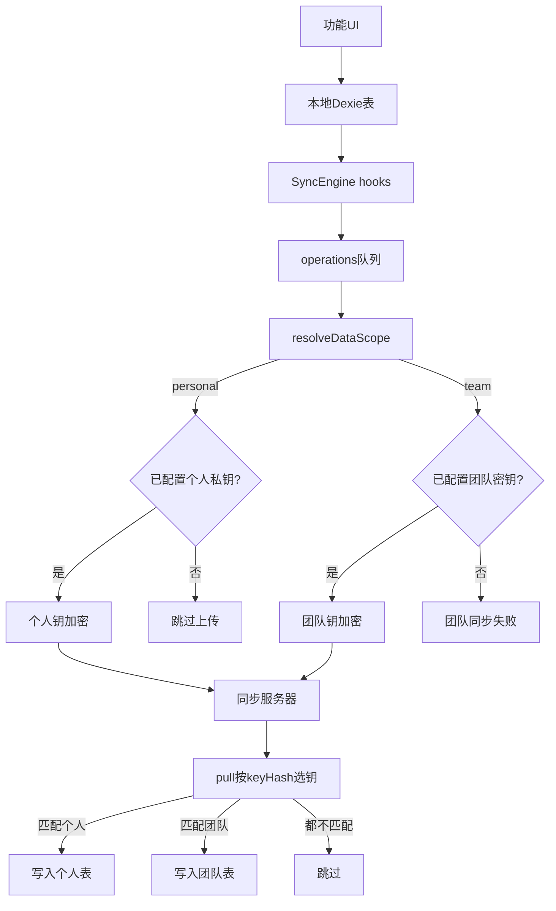

# 个人私钥 + 同服务器 SyncEngine 技术方案

> 状态：草案（基于产品讨论收敛）  
> 目标：在**不新建同步通道**的前提下，用**第二把密钥**隔离个人私密数据与团队共享数据。

---

## 1. 背景与问题

### 1.1 现状

- DPP 使用自定义 SyncEngine + 自建同步服务器，敏感表在推送前用 **团队同步密钥**（`sync_encryption_key`）做 AES-GCM 端到端加密。
- 服务端为盲存储；拉取时按操作上的 `keyHash` 校验，**密钥不一致则跳过**，无法解密的数据不会写入本地。
- 当前同步表（团队域）：`tags`、`jobTags`、`links`、`linkTags`、`blackboard`。
- 验证器表 `totpAccounts` 目前**不在**同步列表；secret 本地可读存储。
- 设置页已增加 **个人私钥**（`personal_encryption_key`），与团队密钥独立，且默认不进入配置导出/导入；**尚未接入任何同步逻辑**。

### 1.2 核心矛盾

团队场景下，多人常共享：

- 同一同步服务器地址 / 访问令牌  
- **同一把团队同步密钥**

若把验证器等私密数据仍用团队密钥加密并推上同一服务器，则**凡持有团队密钥的人都能解密**，等同放进团队共享保险柜。

### 1.3 已排除的路径

| 路径 | 原因 |
|------|------|
| 默认明文式 `chrome.storage.sync` | 无感恢复 ≈ 弱隔离；与「保证安全」冲突 |
| 把验证器直接塞进现有团队密钥 SyncEngine | 同事可见 |
| 另建 WebDAV / 第二套同步服务（本期） | 可行但成本高；非必须 |

### 1.4 推荐路径

**个人私钥 + 同服务器 SyncEngine**：复用现有推拉、cursor、LWW、hooks；个人数据用 `personal_encryption_key` 加密；靠 `keyHash` 与团队数据共存于同一操作日志，互不可见。

---

## 2. 目标与非目标

### 2.1 目标

1. 个人私密数据可在用户自己的多台设备间同步。  
2. 持有团队密钥、但不持有该用户个人私钥的客户端，**无法解密、不会落库**个人密文。  
3. 服务端仍不持有任何明文密钥，不感知表语义（保持盲存储）。  
4. 架构支持「表级默认归属」与未来「实体级归属覆盖」（如黑板私人笔记）。  
5. 后配置个人私钥时，本地已有个人数据可被自动纳入后续上传，无需逐条编辑。

### 2.2 非目标（本期不做）

- 不引入 WebDAV / Drive / `chrome.storage.sync` 作为主同步通道。  
- 不拆第二套 SyncEngine 或第二同步 endpoint。  
- 不实现黑板「设为私人」等实体级 UI（只预留模型）。  
- 不强制做 secret 本地二次 vault（服务端侧由个人钥 E2EE 保护即可；本地加固可另开迭代）。  
- 不把个人私钥并入团队设置导出。

---

## 3. 概念模型：数据归属（Data Scope）

### 3.1 三分法

| 归属 `DataScope` | 含义 | 加密密钥 | 同步 |
|------------------|------|----------|------|
| `team` | 团队共享域 | `sync_encryption_key` | 是 |
| `personal` | 仅个人私密域 | `personal_encryption_key` | 是（需已配置个人私钥） |
| `local` | 永不进 SyncEngine | 无 | 否 |

### 3.2 两层解析（为未来实体级覆盖预留）

解析顺序：

1. **实体级覆盖**：记录上若存在 `dataScope: 'team' | 'personal'`，以之为准。  
2. **表级默认**：查表级注册表。  
3. **安全兜底**：解析为 `personal` 的数据**禁止**回落到团队密钥；无个人私钥则不得上传。

表级默认示意：

| 表 | 默认归属 |
|----|----------|
| `tags` / `jobTags` / `links` / `linkTags` / `blackboard` | `team` |
| `totpAccounts` | `personal` |
| recordings、Jenkins 凭证、绝大多数 settings 等 | `local`（不进同步表列表） |

第一期：`totpAccounts` 整表 `personal`，可不写实体字段。  
后续：`blackboard` 等可增加可选 `dataScope`，默认 `team`；单条设为私人时改为 `personal` 并重加密推送。

### 3.3 密钥角色

| 设置键 | 产品名 | 是否可分享 | 导出 |
|--------|--------|------------|------|
| `sync_encryption_key` | 同步密钥 | 团队成员需一致 | 可随敏感配置导出（现有行为） |
| `personal_encryption_key` | 个人私钥 | **禁止分享给任何人** | **排除**出默认配置导入/导出 |

两把钥匙算法均可复用现有 AES-GCM 256 + `keyHash`（SHA-256 前 8 字节 hex）。

---

## 4. 总体架构

要点：

- **仍是一个 SyncEngine、一个 server、一个 cursor 流**。
- Wire 上表名仍会变成 `encrypted`（现有行为）；**pull 不能靠表名选钥，只能靠 `keyHash`**。
- push 时明文 `op.table` +（未来）`payload.dataScope` 仍可读，用于选钥。

---

## 5. 同步协议行为（相对现状的增量）

### 5.1 现有不变部分

- LWW：比较本地 `updatedAt` 与 `op.timestamp`（客户端时间）。  
- 软删除：`deletedAt`；Dexie `deleting` hook 转软删。  
- `tx.source === 'sync'` 避免回环。  
- 服务端 push/pull API、访问令牌、clientId 过滤不变。

### 5.2 Push（增量）

对每条待推送 op：

1. `scope = resolveDataScope(op)`  
2. `scope === 'personal'`：  
   - 有个人私钥 → `encryptOperation(op, personalKey)`  
   - **无个人私钥 → 本条不上传**，保持 `synced: 0`，打 warn；**不得**改用团队密钥  
3. `scope === 'team'`：  
   - 有团队密钥 → 现有逻辑  
   - 无团队密钥 → 维持现有失败策略（团队同步不可用）  
4. 仅将**实际成功上传**的 op 标记 `synced: 1`（跳过的个人 op 不得被误标已同步）。

混合批次：同一 batch 内可同时含团队密文与个人密文（不同 `keyHash`）。

### 5.3 Pull（增量）

1. 拉取远端 ops（不解密）。  
2. 加载 keyring：`{ teamKey, teamHash, personalKey, personalHash }`（允许缺一）。  
3. 对每条 op：  
   - `keyHash === personalHash` → 个人钥解密  
   - `keyHash === teamHash` → 团队钥解密  
   - 否则或解密失败 → skip  
4. 解密成功后走现有 `applyOperation`（表名已在密文内恢复）。

**仅有个人私钥、无团队密钥**时：仍应能拉取并恢复个人数据；缺团队钥不应导致整次 pull 硬失败到无法处理个人密文。

### 5.4 安全不变量（必须测试）

1. 个人 scope 数据加密所用 CryptoKey **必须**来自 `loadPersonalKey()`。  
2. 任何代码路径不得 `encrypt(personalOp, teamKey)`。  
3. 仅团队密钥的客户端 pull 个人密文 → 全部 skip。  
4. 配置导出 JSON 不含 `personal_encryption_key`。

---

## 6. 第一期范围：验证器（`totpAccounts`）

### 6.1 数据模型变更

- `TotpAccountItem` 增加 `deletedAt?: number`。  
- Dexie schema 升级（新 version）：索引包含 `deletedAt`。  
- 删除改为软删；列表/查询过滤 `!deletedAt`。  
- 将 `totpAccounts` 加入 SyncEngine 表列表。

### 6.2 与个人私钥的产品规则

| 用户状态 | 本地验证器 | 同步 |
|----------|------------|------|
| 未配置个人私钥 | 完全可用 | 不上传 totp ops |
| 已配置个人私钥 | 完全可用 | 参与 push/pull |
| 清除个人私钥 | 本地数据保留 | 停止上传；已在服务器的历史密文仍在，但本机无法再拉新/解旧（除非重新导入同一私钥） |

### 6.3 后配置个人私钥（关键）

场景：本地已有大量验证器账户，用户后来才生成/导入个人私钥。

约定行为：

1. **不删除、不改写**本地账户内容。  
2. 个人私钥**首次成功写入**（生成或导入）后，自动执行 **个人表补建**：  
   - 将本地未软删的 `totpAccounts` 写入 `operations`（`type: 'create'`，`synced: 0`）  
   - 范围仅限个人同步表，避免误清整个团队 ops（不要直接调用会 `operations.clear()` 的全量 `regenerateOperations`，或提供「仅 personal 表」的 enqueue API）  
3. 下一次正常同步即可上传。  
4. UI toast 提示：「个人私钥已就绪，验证器数据将在下次同步时上传」。

更换个人私钥（覆盖）：

- 强确认警告：旧私钥加密的云端个人数据将无法再解。  
- 本期可不做自动「用新钥重加密云端」迁移；用户需接受旧云端个人密文失效，并由新钥重新上传本地权威数据（补建 enqueue）。  
- 文档明确说明。

### 6.4 跨设备恢复步骤（用户路径）

设备 A：配置同步服务器 + 团队密钥（如需团队数据）+ **生成个人私钥并自行备份** + 使用验证器 → 同步。  
设备 B：同服务器 +（可选）团队密钥 + **导入同一把个人私钥** → 同步 → 验证器恢复。

无需 Chrome 账号级扩展存储；个人私钥由用户保管（复制到剪贴板 / 密码管理器）。

---

## 7. 代码落点（建议）

| 模块 | 路径 | 职责 |
|------|------|------|
| 归属注册 | 新建 `src/lib/sync/dataScope.ts` | `DataScope`、表默认、`resolveDataScope(op)` |
| 选钥 | 新建 `src/lib/sync/syncKeys.ts` | keyring、按 scope 取钥、禁止回落 |
| 个人钥 | 已有 `src/lib/crypto/personalKey.ts` | load/store/clear |
| Push | `src/db/syncProvider.ts` + `SyncEngine.push.ts` | 按条选钥；跳过无钥个人 op；精确标记 synced |
| Pull | `src/lib/sync/SyncEngine.pull.ts` | 双钥按 keyHash 解密 |
| 注册表 | `src/db/syncEngine.ts` | 加入 `totpAccounts` |
| TOTP 模型 | `types` / `schema` / `totpMutations` / `totpQueries` | 软删与过滤 |
| 后配补建 | `personalKey` 写入成功路径或 SyncEngine API | enqueue 个人表 |
| 文案 | Options 个人私钥区、`migrationGuide`、README、CLAUDE | 口径一致 |

选钥实现**禁止**长期写死 `if (table === 'totpAccounts')` 作为唯一依据；应走 `resolveDataScope`，以便黑板实体级私人条复用。

---

## 8. 未来扩展：公共表中的私人条目

示例：黑板一条「私人笔记」。

1. 实体增加可选 `dataScope?: 'team' | 'personal'`，缺省 `team`。  
2. 用户「设为私人」→ 本地改 scope → 用个人钥重加密推送（新 op）；旧团队密文侧需产品定义（覆盖更新 / 软删旧共享视图等，另开设计）。  
3. 同事 pull：个人 `keyHash` 不匹配 → 看不到。  
4. 「设为团队」→ 明确确认后改为团队钥加密上传（主动分享）。

本期只要求选钥与归属解析**兼容该模型**，不实现 UI。

---

## 9. 威胁模型与残留风险

| 威胁 | 缓解 |
|------|------|
| 同事持有团队密钥 | 个人数据不同团队钥；keyHash skip |
| 服务器管理员 | 仅见密文 |
| 个人私钥泄露 | 等同身份验证器与个人密文泄露；文案强调勿分享、勿进团队导出 |
| 本机恶意软件 / 未锁设备 | 扩展本地仍可能读到已解密或明文 secret；属浏览器扩展固有边界 |
| 用户丢失个人私钥 | 无法解云端个人密文；需本地备份或接受损失 |
| 弱操作：误把个人私钥当团队密钥分发 | 产品文案 + UI 分区 + 导出排除 |

本方案**不声称**绝对安全；目标是在团队共用同步基础设施下，提供与「个人保险柜」等价的密钥隔离。

---

## 10. 分阶段落地

### 阶段 A — 归属与双钥同步基础设施（可先于 UI 大改）

1. `dataScope.ts` + `syncKeys.ts`  
2. 改造 push/pull  
3. 单测/手动验证：混合 batch、仅个人钥 pull、禁止个人回落团队钥  

### 阶段 B — 验证器接入

1. 软删 + schema  
2. 表注册进 SyncEngine  
3. 后配个人私钥自动 enqueue  
4. 迁移指南 / README / CLAUDE 更新  

### 阶段 C — 产品增强（可选后续）

1. 同步设置中展示「个人数据同步状态」（待推条数、缺私钥提示）  
2. 实体级 `dataScope`（黑板等）  
3. 本地 secret vault、剪贴板清理等加固  

---

## 11. 验收标准

1. **无个人私钥**：验证器本地 CRUD 正常；push 不上传 totp；团队同步不受影响。  
2. **有个人私钥**：两台设备同服务器 + 同个人私钥，验证器增删改可互相同步。  
3. **仅团队密钥的第三客户端**：pull 后本地无他人验证器账户。  
4. **先数据后配钥**：配置个人私钥后，无需逐条编辑，下次同步能上传已有账户。  
5. **导出配置**：不含 `personal_encryption_key`。  
6. **编译与 lint**：`pnpm compile`、相关 eslint 通过。  
7. **不变量**：代码审查确认不存在 personal op + team key 加密路径。

---

## 12. 决策摘要

| 议题 | 决策 |
|------|------|
| 同步通道 | 复用现有 SyncEngine + 同服务器 |
| 隔离手段 | 第二把密钥（个人私钥）+ keyHash |
| 验证器归属 | 表级 `personal` |
| 未来黑板私人条 | 实体级 `dataScope` 覆盖（预留） |
| 无个人私钥 | 本地可用，不同步个人数据 |
| 后配个人私钥 | 自动 enqueue 本地个人表 |
| 与 Authenticator 无感同步 | 不模仿其默认明文；接受「需自行保管个人私钥」 |

---

## 13. 相关代码锚点

- 团队表注册：`src/db/syncEngine.ts`  
- 加密推送：`src/db/syncProvider.ts`、`src/lib/sync/crypto-helpers.ts`  
- 拉取跳过：`src/lib/sync/SyncEngine.pull.ts`  
- 个人私钥：`src/lib/crypto/personalKey.ts`、`SettingMap.personal_encryption_key`  
- 导出排除：`src/entrypoints/options/optionsShared.ts` → `EXCLUDED_SETTINGS`  
- 验证器：`src/features/totp/*`、`src/lib/db/totp*.ts`、`src/db/schema.ts`
